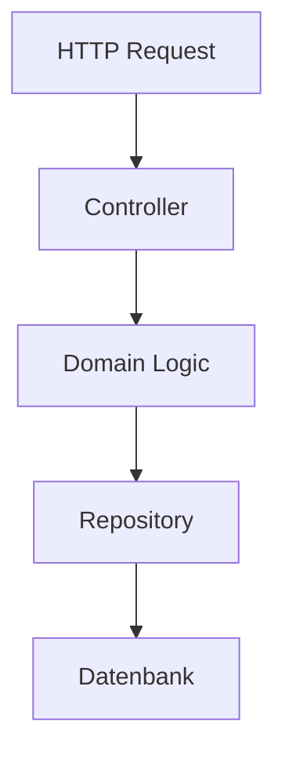

# Write Article

Write a German-language software architecture article for nicograef.com.
The output is a single Markdown file saved to `content/articles/<slug>.md`.

You may skip steps if you don't consider them necessary.

## Workflow

### 1. Receive Input

Accept the following inputs from the user — all may be provided at once:

- **Thema** (required) — the topic or concept to write about
- **Quellen-URLs** (optional) — a list of source URLs to fetch and learn from
- **Session-Notizen / Entwurf** (optional) — prior research, outlines, or
  session context (e.g. a conversation with an AI assistant)

**Wenn keine URLs angegeben wurden:** Perform a web search for 3–5
authoritative sources on the topic (official documentation, well-known DDD /
architecture references, high-quality blog posts). Present each candidate with
its URL and a one-sentence description of its content focus. Ask the user to
confirm which sources to fetch before proceeding to Step 2.

### 2. Web Research

Fetch all confirmed source URLs using the `fetch_webpage` tool. Read and
synthesize the content into a **Recherche-Protokoll** to present to the user.

**Recherche-Protokoll format:**

1. **Kernerkenntnisse** — 5–8 key findings from the sources: core definitions,
   mental models, notable real-world examples, common nuances or
   misconceptions. Cite the source URL inline for each finding.
2. **Terminologie-Liste** — the 5–10 core technical terms to be used
   consistently throughout the article (see Style Guide,
   Terminologie-Konsistenz). One term per line:
   `**Begriff** — kurze deutsche Erklärung`.
3. **Artikeltyp-Empfehlung** — recommend one of the three article types
   ("Was ist X?", Deep Dive, Pattern-Artikel) with 1–2 sentences of reasoning.
4. **Titelvorschläge** — propose 2–3 German `# Title` options following the
   pattern `[Konzept] — [Nutzen für Leser]`. Mark one as recommended.

**Session-Notizen / Entwurf:** If the user also provided prior session notes
or a draft, integrate them into the Recherche-Protokoll — treat them as an
additional source and note any differences or gaps compared to the fetched
URLs.

After presenting the Recherche-Protokoll, ask:
*"Sollen wir mit diesen Erkenntnissen und [empfohlenem Titel] fortfahren, oder
möchtest du Titel, Artikeltyp oder Terminologie anpassen?"*

Do not proceed to Step 3 until the user confirms.

### 3. Research existing articles

Read the existing articles in `content/articles/` and `content/articles.json`
to understand:

- Which topics are already covered (avoid duplication)
- Which articles could be cross-referenced from the new one
- Which articles already link to concepts related to the new topic
- What images exist in `assets/img/articles/` that might be relevant

**Verwandte Patterns und Konzepte** — Benenne alle Patterns und Konzepte, die
inhaltlich mit dem neuen Thema zusammenhängen, und klassifiziere jeden Eintrag:

- **Intern verlinkbar** — Ein Artikel dazu existiert bereits → Link vorschlagen
- **Future-Article-Kandidat** — Kein Artikel vorhanden → als Kandidat
  markieren (wird in Schritt 8 ausgegeben)

Verwandte Patterns nie unverlinkt und unerklärt lassen: entweder erklären,
intern verlinken oder explizit aus dem Artikel ausklammern. Gib die Ergebnisliste
im Outline-Schritt (Schritt 4) mit aus.

### 4. Create an outline

Based on the Recherche-Protokoll from Step 2, present the proposed article
structure as a numbered heading list. Include a one-sentence summary per
section. Ask the user to confirm or adjust before writing.

Include the list of related patterns from Step 3 (Research) so the user can
see the cross-reference landscape before confirming the outline.

> **Pattern-Artikel:** Folgt der Outline dem Pattern-Artikel-Typ, muss sie
> der Pflicht-Struktur aus dem Style Guide folgen: Einleitung: Das Problem →
> Das Pattern → Praxisbeispiel → Wann lohnt sich das? → Fazit.

### 5. Create diagrams

For each concept that benefits from a visual explanation, create a **simple
Mermaid diagram**. The user will convert these to images using Excalidraw.

**Rules for Mermaid diagrams:**

- Keep them simple — prefer clarity over completeness.
- Use `graph TD` (top-down) or `graph LR` (left-right) for most diagrams.
  Use `sequenceDiagram` only when showing message flow between actors.
- Short, readable node labels (2–4 words). German labels when they match the
  article terminology.
- No styling directives (`style`, `classDef`, `linkStyle`) — Excalidraw
  handles the visual design.
- Maximum ~10 nodes per diagram. If more are needed, split into multiple
  diagrams.
- Present each diagram in a fenced `mermaid` code block with a brief caption
  explaining what the diagram shows.

**Example:**

````markdown

_Vereinfachter Request-Flow durch die Schichten_
````

Do **not** embed Mermaid blocks in the article Markdown itself (the website
does not render Mermaid). Instead, present them separately after the article
so the user can convert them to PNG/SVG in Excalidraw and place them via the
normal image syntax (``).

Add corresponding image placeholders in the article body where each diagram
should appear:

```markdown

_Bildunterschrift_
```

### 6. Write the article

Write the full article following the Style Guide below. Save it to
`content/articles/<slug>.md`.

**Slug convention:** German, kebab-case, descriptive
(e.g. `was-ist-event-sourcing`, `event-sourcing-am-beispiel-warenkorb-erklaert`).

### 7. Self-review

Before saving the file, read through the finished article paragraph by paragraph
and check each of the following points. Fix any issues found inline.

1. **Satzlänge** — Sätze mit mehr als ~25 Wörtern aufteilen.
2. **Füllwörter** — Streiche: "grundsätzlich", "eigentlich", "sozusagen",
   "im Grunde", "Es ist wichtig zu beachten, dass…", "Man kann sagen, dass…".
3. **Jargon-Dichte** — Maximal 2 uneingeleitete Fachbegriffe pro Absatz.
   Neue Begriffe beim ersten Vorkommen fett setzen und kurz erklären.
4. **Zweiter-Lese-Test** — Jeden Satz, der einen zweiten Leseversuch
   benötigt, umschreiben.
5. **Visueller Rhythmus** — Prose-Blöcke mit mehr als 4 Absätzen durch ein
   visuelles Element (Code-Block, Tabelle, Aufzählung, Blockquote) aufbrechen.
6. **Zwischenfazit-Check** _(nur Deep Dive)_ — Jede `##`-Sektion endet mit
   einem Übergangssatz zur nächsten Sektion.
7. **Terminologie** — Alle Begriffe müssen konsistent mit der Begriffsliste
   aus Schritt 2 (Recherche-Protokoll, Terminologie-Liste) verwendet
   werden.

Gib ein kurzes **Self-Review-Protokoll** aus — eine Liste der vorgenommenen
Änderungen (z. B. "Satz in Abschnitt X aufgeteilt", "Füllwort 'eigentlich'
 entfernt"). Speichere die Datei erst nach Ausgabe des Protokolls.

### 8. Post-write checklist

#### Backward Linking

Scan all existing Markdown files in `content/articles/` for passages that
mention the new article's topic or naturally lead into it. For each match:

1. Quote the relevant sentence(s) from the existing article.
2. Propose a concrete edit — show exactly which sentence to add or change and
   where (e.g. after which paragraph).
3. Ask the user to confirm before making the edit.

Run this scan **after** saving the new article file. Do not edit existing
articles without explicit user confirmation.

Also output the **Future-Article-Kandidaten** list collected during Step 3
(Research) so the user has a record of suggested follow-up topics.

#### SEO Description

Propose the `description` value for `articles.json`. Rules:

- **Max. 155 characters** — show the character count next to the proposal.
- Answer the article's core question in one complete sentence.
- Make the reader want to click (concrete benefit, not a vague summary).

| | Beispiel |
|---|---|
| ❌ Schlecht | `"Ein Artikel über Event Sourcing und wie es funktioniert."` (57 Zeichen) |
| ✅ Gut | `"Wie du mit Event Sourcing jeden Zustandswechsel nachvollziehbar speicherst — und warum das dein Debugging revolutioniert."` (120 Zeichen) |

Present the proposal as: `"<description>"` **(N Zeichen)**. Adjust until it
fits within 155 characters and the user approves it.

#### Checklist

After completing the above, remind the user:

- [ ] Add an entry to `content/articles.json` with the correct metadata
      (see format below, use the approved SEO description)
- [ ] Convert Mermaid diagrams to images in Excalidraw and save to
      `assets/img/articles/`
- [ ] Add any other referenced images to `assets/img/articles/`
- [ ] Verify the article renders correctly with the dev server
      (`php -S 0.0.0.0:8080 router.php`)

**articles.json entry format:**

```json
{
    "slug": "<slug>",
    "title": "<exact H1 title from the article>",
    "description": "<approved SEO description, max 155 characters>",
    "date": "<YYYY-MM-DD>",
    "author": "Nico Gräf",
    "tags": ["Tag1", "Tag2"]
}
```

The new entry should be inserted at the top of the JSON array (newest first).

## Style Guide

These rules are extracted from the existing articles and must be followed
consistently.

### Language & Tone

- **German** throughout. Informal "Du"-Anrede.
- **Simple, clean, natural language.** Write like you would explain something
  to a colleague over coffee — clear and direct, but not sloppy. Avoid overly
  academic or stiff phrasing. Prefer short sentences. If a sentence needs a
  second read to understand, rewrite it.
- No filler phrases ("Es ist wichtig zu beachten, dass…",
  "Grundsätzlich kann man sagen…"). Get to the point.
- Explain concepts in a way that is accessible to developers who are new to
  the topic, without being condescending.
- Use **analogies** to make abstract concepts tangible
  ("Stell dir X wie Y vor: …").
- **Terminologie-Konsistenz** — Lege vor dem Schreiben eine Begriffsliste der
  Kern-Fachbegriffe fest (z. B. "Event Store", "Aggregate", "Command"). Einmal
  gewählte Terme werden durchgängig verwendet. Synonyme sind verboten — außer
  bei der einführenden Erklärung eines Begriffs
  (z. B. "Ein **Event Store** — auch *Ereignisspeicher* genannt — ist …").

### Title & Opening

- First line: `# Title` — must match the `title` field in articles.json.
- Opening: 1–2 paragraphs that explain the concept in plain, accessible
  language. No preamble ("In diesem Artikel…") — get to the point.
- If the article has a limited scope, state it early as a blockquote:
  `> Diese Erklärung wendet sich an …`

### Structure

- `##` for main sections, `###` for subsections.
- Keep a logical flow: concept → explanation → example → (optional)
  advantages/disadvantages.
- **Visueller Rhythmus** — Maximal ~3–4 aufeinanderfolgende Absätze Fließtext.
  Danach muss ein visuelles Element folgen (Code-Block, Tabelle, Bild,
  Aufzählung oder Blockquote).

### Formatting Conventions

| Element | Convention |
|---------|-----------|
| Technical terms | **Bold** on first use, with German explanation if English |
| Abbreviations | `<abbr title="Full Name">ABBR</abbr>` |
| Code examples | Fenced code blocks with language tag (```sql, ```json, etc.) |
| Tables | Markdown tables for comparisons, data examples, API endpoints |
| Images | `` followed by `_Caption_` on the next line |
| Blockquotes | For disclaimers, scope notes, tips (`> **Disclaimer:** …`) |
| Cross-references | `[Article title](/articles/slug)` for links to other articles |
| Pros/Cons lists | Bulleted list with **bold keyword**: explanation |
| Inline code | Backtick-wrapped for identifiers, file names, commands |
| Emphasis | Use `—` (em dash) instead of `-` for parenthetical remarks |

### Content Patterns

- **"Was ist X?" articles** (overview): Define the concept, give a short
  example, list advantages and disadvantages. Keep it concise. Link to a
  deeper article if one exists.
- **"X am Beispiel Y erklärt" articles** (deep dive): Start with the
  traditional approach (e.g. CRUD), show its limitations, then introduce the
  new approach with a worked example. Include code, tables, and step-by-step
  walkthroughs.
- **Disclaimer pattern**: If the topic could be over-applied, add a
  disclaimer early: `> **Disclaimer:** X hat — wie alles — seine Vor- und
  Nachteile …`
- **Problem-first Hook** — Jeder Artikel beginnt mit einem konkreten Problem
  oder Pain Point, nicht mit einer Definition. Beispiel: Statt "Event Sourcing
  ist ein Muster, bei dem …" → "Du hast einen Bug in der Produktion. Du weißt,
  dass etwas schiefgelaufen ist — aber du kannst nicht mehr nachvollziehen,
  wann und warum."
- **Zwischenfazit** _(nur Deep Dive)_ — Jede `##`-Sektion endet mit einem
  Übergangssatz, der das Gelernte kurz zusammenfasst und auf die nächste
  Sektion hinleitet. Beispiel: "Damit hast du gesehen, wie Events gespeichert
  werden — als Nächstes schauen wir uns an, wie man den aktuellen Zustand
  daraus rekonstruiert."
- **Glossar** — Bei ≥ 5 neuen Fachbegriffen erscheint am Ende des Artikels ein
  `## Glossar`-Abschnitt im Format `**Begriff**: Kurzdefinition`. Kein Glossar
  bei weniger als 5 neuen Begriffen.
- **Pattern-Artikel** _(dritter Artikel-Typ)_ — Neben "Was ist X?" und Deep
  Dive gibt es Pattern-Artikel, die ein konkretes Entwurfsmuster beschreiben.
  Pflicht-Struktur:
  1. **Einleitung: Das Problem** — Welches konkrete Problem löst das Pattern?
  2. **Das Pattern** — Wie funktioniert die Lösung?
  3. **Praxisbeispiel** — Code, Tabelle oder Schritt-für-Schritt-Walkthrough.
  4. **Wann lohnt sich das?** — Enthält: Kriterien (wann passt das Pattern),
     Gegenindikatoren (wann lieber nicht), Kombinations-Hinweise (welche
     Patterns ergänzen sich gut).
  5. **Fazit** — Kurze Zusammenfassung.

### What NOT to include

- No YAML frontmatter in the Markdown file (metadata lives in articles.json).
- No table of contents (the website does not render one).
- No author byline in the article body (handled by the template).
- No date in the article body (handled by articles.json).

## Constraints

- **Only create the Markdown file.** Do not modify `articles.json`, templates,
  or PHP code.
- **Do not invent image paths** that don't exist. Use placeholder paths
  following the pattern `<slug>-<diagram-name>.png` and list them in the
  post-write checklist so the user can create the images from the Mermaid
  diagrams.
- **Follow existing patterns exactly.** When in doubt, match what the existing
  articles do.

## Quality

- The self-review in Step 7 is the primary quality gate for article content.
  Complete all 7 check points and output the protocol before saving.
- After task completion, include a human-readable summary paragraph alongside
  the commit message (see AGENTS.md, Git Workflow).
